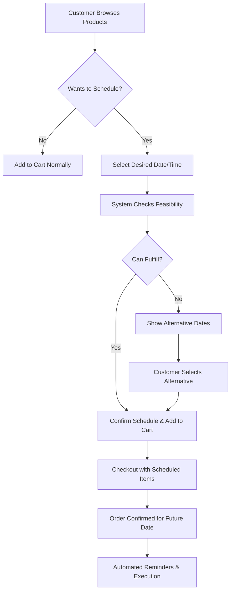

# Customer Order Scheduling Feature Analysis

## 📋 Executive Summary

This document analyzes the requirements and implementation strategy for enabling patrons and guests to schedule orders based on their desired delivery/pickup dates, transforming the current "when can you fulfill this?" model to "I need this by [date]" customer-driven scheduling.

## 🎯 Feature Vision

### Current State vs. Desired State

**Current Model:**
- Artisan-driven scheduling: "I can make this in X days"
- Customers accept when product will be ready
- Limited to pickup time selection during checkout

**Desired Model:**
- Customer-driven scheduling: "I need this by [specific date]"
- Artisans commit to customer's timeline
- Advanced scheduling throughout the shopping experience
- Flexible delivery/pickup date selection

## 🔍 Current System Analysis

### ✅ Existing Scheduling Infrastructure

**1. Pickup Time Service**
- **Location:** `frontend/src/services/pickupTimeService.js`
- **Capabilities:** Generates available time slots based on artisan schedules
- **Limitations:** Only for pickup scheduling, not order placement scheduling

**2. Product Lead Time Calculation**
- **Implementation:** Basic lead time + lead time unit
- **Product Types:** Made-to-order and scheduled orders
- **Limitations:** Static lead times, no dynamic scheduling

**3. Artisan Schedule Management**
- **Location:** Artisan profile management
- **Capabilities:** Operating hours, pickup schedules
- **Limitations:** No production scheduling or capacity management

### ❌ Missing Components for Customer Scheduling

**1. Customer Preference Collection**
- No interface for customers to specify desired delivery dates
- No "schedule for later" functionality during shopping
- Missing advanced scheduling options in cart/checkout

**2. Dynamic Feasibility Checking**
- No real-time validation of customer-requested dates
- No integration between customer preferences and artisan capacity
- Missing conflict resolution for impossible timelines

**3. Flexible Order Management**
- No support for future-dated order processing
- Missing scheduled order execution system
- No automated reminders for upcoming scheduled orders

## 🚀 Proposed Customer Scheduling System

### 1. Customer Experience Flow



### 2. User Interface Components

#### A. Product Page Scheduling Widget
```javascript
// New component for product-level scheduling
const ProductSchedulingWidget = ({ product, onScheduleSelect }) => {
  return (
    <div className="scheduling-widget">
      <h3>When do you need this?</h3>
      
      {/* Schedule Options */}
      <div className="schedule-options">
        <button>ASAP (Ready in {product.leadTime} {product.leadTimeUnit})</button>
        <button>Schedule for Later</button>
      </div>
      
      {/* Date/Time Picker */}
      {showSchedulePicker && (
        <SchedulePickerComponent 
          product={product}
          onDateSelect={onScheduleSelect}
          minDate={calculateMinDate(product)}
          maxDate={calculateMaxDate(product)}
        />
      )}
    </div>
  );
};
```

#### B. Advanced Cart Scheduling
```javascript
// Enhanced cart with scheduling management
const ScheduledCartItem = ({ item, onReschedule }) => {
  return (
    <div className="cart-item scheduled">
      <div className="item-details">...</div>
      
      <div className="schedule-info">
        <div className="desired-date">
          <CalendarIcon />
          Needed by: {formatDate(item.customerDesiredDate)}
        </div>
        
        <div className="feasibility-status">
          {item.canFulfillByDate ? (
            <CheckIcon className="text-green-500" />
          ) : (
            <ExclamationIcon className="text-amber-500" />
          )}
          {item.feasibilityMessage}
        </div>
        
        <button onClick={() => onReschedule(item)}>
          Change Date
        </button>
      </div>
    </div>
  );
};
```

### 3. Backend Services Architecture

#### A. Customer Schedule Service
```javascript
class CustomerScheduleService {
  /**
   * Check if an order can be fulfilled by customer's desired date
   */
  async checkScheduleFeasibility(customerId, items, desiredDate, deliveryMethod) {
    const feasibilityResults = [];
    
    for (const item of items) {
      const result = await this.checkItemFeasibility(
        item.productId, 
        item.quantity, 
        desiredDate,
        deliveryMethod
      );
      feasibilityResults.push(result);
    }
    
    return {
      canFulfillAll: feasibilityResults.every(r => r.feasible),
      itemResults: feasibilityResults,
      suggestedAlternatives: this.getSuggestedDates(feasibilityResults)
    };
  }
  
  /**
   * Calculate production timeline for specific item and desired date
   */
  async checkItemFeasibility(productId, quantity, desiredDate, deliveryMethod) {
    const product = await this.getProductWithCapacity(productId);
    const artisan = await this.getArtisanWithQueue(product.artisanId);
    
    // Calculate required start date working backwards from desired date
    const requiredStartDate = this.calculateRequiredStartDate(
      desiredDate, 
      product, 
      deliveryMethod
    );
    
    // Check if artisan can start production by required date
    const queuePosition = await this.findQueuePosition(
      artisan.id, 
      requiredStartDate, 
      product.estimatedProductionTime
    );
    
    return {
      feasible: queuePosition.canAccommodate,
      productId,
      desiredDate,
      requiredStartDate,
      queuePosition: queuePosition.position,
      estimatedStartDate: queuePosition.actualStartDate,
      estimatedCompletionDate: queuePosition.completionDate,
      delayDays: queuePosition.delayDays || 0
    };
  }
  
  /**
   * Suggest alternative dates when desired date isn't feasible
   */
  getSuggestedDates(feasibilityResults) {
    const alternatives = [];
    
    // Find next 3 available dates after desired date
    const infeasibleItems = feasibilityResults.filter(r => !r.feasible);
    
    for (let i = 1; i <= 14; i++) { // Check next 14 days
      const alternateDate = new Date();
      alternateDate.setDate(alternateDate.getDate() + i);
      
      const canFulfillAll = infeasibleItems.every(item => 
        this.canFulfillByDate(item.productId, alternateDate)
      );
      
      if (canFulfillAll) {
        alternatives.push({
          date: alternateDate,
          confidence: this.calculateConfidence(alternateDate, infeasibleItems)
        });
        
        if (alternatives.length >= 3) break;
      }
    }
    
    return alternatives;
  }
}
```

#### B. Production Queue Integration
```javascript
class ProductionQueueService {
  /**
   * Find available slot in artisan's queue for customer's timeline
   */
  async findQueuePosition(artisanId, requiredStartDate, estimatedDuration) {
    const currentQueue = await this.getArtisanQueue(artisanId);
    
    // Sort queue by start date
    const sortedQueue = currentQueue.sort((a, b) => 
      new Date(a.startDate) - new Date(b.startDate)
    );
    
    // Find gap in schedule that can accommodate new order
    const availableSlot = this.findAvailableSlot(
      sortedQueue, 
      requiredStartDate, 
      estimatedDuration
    );
    
    return {
      canAccommodate: availableSlot.found,
      position: availableSlot.position,
      actualStartDate: availableSlot.startDate,
      completionDate: availableSlot.completionDate,
      delayDays: availableSlot.delayDays
    };
  }
  
  /**
   * Reserve production slot for scheduled order
   */
  async reserveProductionSlot(artisanId, orderId, startDate, duration) {
    const reservation = {
      orderId,
      artisanId,
      startDate,
      estimatedDuration: duration,
      status: 'reserved',
      createdAt: new Date()
    };
    
    await this.saveQueueReservation(reservation);
    return reservation;
  }
}
```

### 4. Database Schema Extensions

#### A. Scheduled Orders Table
```javascript
// New collection for customer-scheduled orders
const customerScheduledOrders = {
  _id: ObjectId,
  customerId: ObjectId,
  items: [{
    productId: ObjectId,
    quantity: Number,
    customerDesiredDate: Date,
    customerDesiredTime: String, // "morning", "afternoon", "evening", or specific time
    deliveryMethod: String, // "pickup", "delivery"
    
    // Feasibility Analysis
    feasibilityCheckedAt: Date,
    canFulfillByDate: Boolean,
    requiredStartDate: Date,
    estimatedCompletionDate: Date,
    queuePosition: Number,
    
    // Production Scheduling
    reservedProductionSlot: {
      startDate: Date,
      endDate: Date,
      artisanId: ObjectId,
      status: String // "reserved", "confirmed", "in_production", "completed"
    }
  }],
  
  scheduleType: String, // "immediate", "future_date", "recurring"
  
  // Customer Preferences
  customerPreferences: {
    desiredDeliveryDate: Date,
    desiredTimeWindow: String,
    flexibilityDays: Number, // How many days flexible customer is
    priorityLevel: String, // "normal", "rush", "flexible"
  },
  
  // Order Status
  status: String, // "scheduled", "confirmed", "in_production", "ready", "completed", "cancelled"
  scheduledExecutionDate: Date,
  actualExecutionDate: Date,
  
  // Notifications
  reminders: [{
    type: String, // "upcoming_production", "ready_soon", "ready_for_pickup"
    scheduledDate: Date,
    sent: Boolean,
    sentAt: Date
  }],
  
  createdAt: Date,
  updatedAt: Date
};
```

#### B. Artisan Production Calendar
```javascript
// Enhanced artisan capacity tracking
const artisanProductionCalendar = {
  artisanId: ObjectId,
  date: Date,
  
  capacity: {
    totalHours: Number,
    bookedHours: Number,
    availableHours: Number,
    
    // Slot-based scheduling
    timeSlots: [{
      startTime: String, // "09:00"
      endTime: String,   // "12:00" 
      status: String,    // "available", "booked", "blocked"
      reservedFor: ObjectId, // Order ID if booked
      productType: String,   // Type of product being made
      estimatedDuration: Number // Hours
    }]
  },
  
  // Production preferences
  preferences: {
    batchProduction: Boolean,
    preferredProductTypes: [String],
    breakTimes: [String],
    maxConcurrentOrders: Number
  },
  
  updatedAt: Date
};
```

### 5. Implementation Phases

#### Phase 1: Basic Customer Scheduling (Weeks 1-3)
**Components:**
- Product-level "Schedule for Later" button
- Simple date picker with feasibility checking
- Basic cart integration for scheduled items
- Backend feasibility service

**Deliverables:**
- CustomerScheduleService foundation
- Basic UI components
- Simple date validation
- Database schema creation

#### Phase 2: Advanced Scheduling Features (Weeks 4-6)
**Components:**
- Production queue integration
- Alternative date suggestions
- Time window preferences
- Enhanced cart scheduling management

**Deliverables:**
- Production queue service
- Advanced feasibility checking
- Alternative date recommendations
- Enhanced UI with time preferences

#### Phase 3: Production Integration (Weeks 7-9)
**Components:**
- Artisan production calendar
- Automated production scheduling
- Queue optimization algorithms
- Capacity management tools

**Deliverables:**
- Artisan calendar system
- Production slot reservations
- Automated scheduling optimization
- Artisan dashboard enhancements

#### Phase 4: Customer Experience Polish (Weeks 10-12)
**Components:**
- Proactive notifications and reminders
- Customer scheduling dashboard
- Flexible rescheduling options
- Advanced scheduling preferences

**Deliverables:**
- Notification automation
- Customer scheduling portal
- Rescheduling workflows
- Advanced preference management

## 💡 Key Features Breakdown

### 1. Smart Feasibility Engine
```javascript
// Real-time feasibility checking as customer selects dates
const feasibilityEngine = {
  checkRealTimeFeasibility: async (productId, desiredDate) => {
    // Consider current production queue
    // Factor in lead times and capacity
    // Account for delivery method timing
    // Return confidence level and alternatives
  }
};
```

### 2. Intelligent Date Suggestions
- **Batch Production Opportunities**: Suggest dates when similar items are being made
- **Capacity Optimization**: Recommend dates with available artisan capacity
- **Delivery Coordination**: Align with delivery route optimization
- **Seasonal Considerations**: Account for holiday schedules and seasonal demand

### 3. Flexible Customer Preferences
- **Date Flexibility**: "I need this by [date] but can wait 2-3 extra days if needed"
- **Time Windows**: Morning, afternoon, evening preferences
- **Priority Levels**: Rush orders, standard timing, flexible scheduling
- **Recurring Orders**: Weekly bread delivery, monthly meal prep, etc.

### 4. Proactive Communication
```javascript
// Automated notification system for scheduled orders
const scheduledOrderNotifications = {
  upcomingProduction: "Your custom cake will start production tomorrow!",
  productionStarted: "Good news! Production has begun on your order.",
  halfway: "Your order is 50% complete. Estimated completion: [date]",
  readySoon: "Your order will be ready for pickup tomorrow at 2 PM!",
  readyNow: "Your order is ready! Please pickup within 48 hours."
};
```

## 🎯 Business Impact Analysis

### Customer Benefits
- **Convenience**: Plan orders around their schedule, not artisan availability
- **Predictability**: Know exactly when products will be ready
- **Flexibility**: Easy rescheduling and preference management
- **Transparency**: Real-time updates on production progress

### Artisan Benefits
- **Better Planning**: Advanced notice of upcoming orders
- **Capacity Optimization**: Batch production opportunities
- **Reduced Rush Orders**: Customers plan ahead more often
- **Customer Satisfaction**: Meet customer timeline expectations

### Platform Benefits
- **Higher Conversion**: Remove timing uncertainty barrier
- **Premium Pricing**: Guaranteed delivery date service
- **Customer Retention**: Enhanced shopping experience
- **Operational Efficiency**: Better resource planning across artisans

## 📊 Implementation Complexity Assessment

### High Complexity Areas
1. **Production Queue Management**: Complex algorithm for optimal scheduling
2. **Multi-Artisan Orders**: Coordinating schedules across multiple producers
3. **Real-Time Feasibility**: Fast checking across large product catalogs
4. **Conflict Resolution**: Handling schedule changes and capacity conflicts

### Medium Complexity Areas
1. **Customer UI/UX**: Intuitive scheduling interfaces
2. **Notification System**: Automated timeline communications
3. **Calendar Integration**: Artisan production calendar management
4. **Rescheduling Logic**: Flexible date change workflows

### Low Complexity Areas
1. **Basic Date Picker**: Standard calendar selection components
2. **Simple Feasibility**: Basic lead time + date validation
3. **Database Schema**: Straightforward data structure extensions
4. **Basic Notifications**: Standard email/SMS integration

## 🚀 Recommended Implementation Strategy

### MVP Approach (4-6 weeks)
1. **Basic "Schedule for Later"** button on product pages
2. **Simple date picker** with basic feasibility checking
3. **Enhanced cart** showing scheduled items
4. **Basic notification** system for scheduled orders

### Full Feature Set (12-16 weeks)
1. Complete production queue integration
2. Advanced scheduling optimization
3. Comprehensive customer scheduling dashboard
4. Full artisan capacity management tools

### Success Metrics
- **Adoption Rate**: % of orders using scheduling feature
- **Customer Satisfaction**: Delivery timing satisfaction scores
- **Conversion Impact**: Orders completed vs. abandoned due to timing
- **Operational Efficiency**: Artisan capacity utilization improvement

---

*This analysis provides a comprehensive roadmap for implementing customer-driven order scheduling, transforming the BazaarMKT platform from artisan-centric to customer-centric timing control.*
