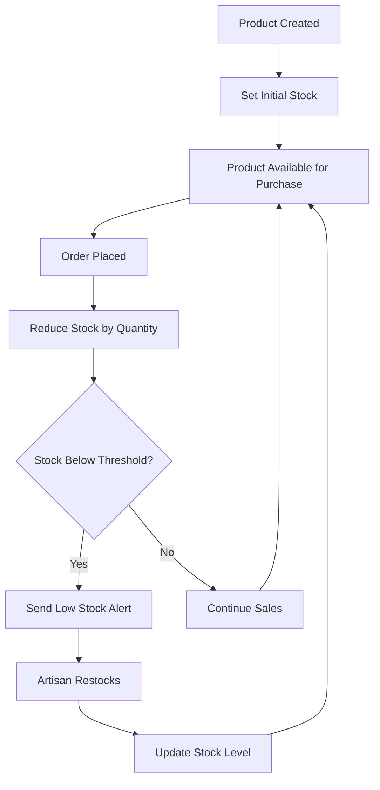
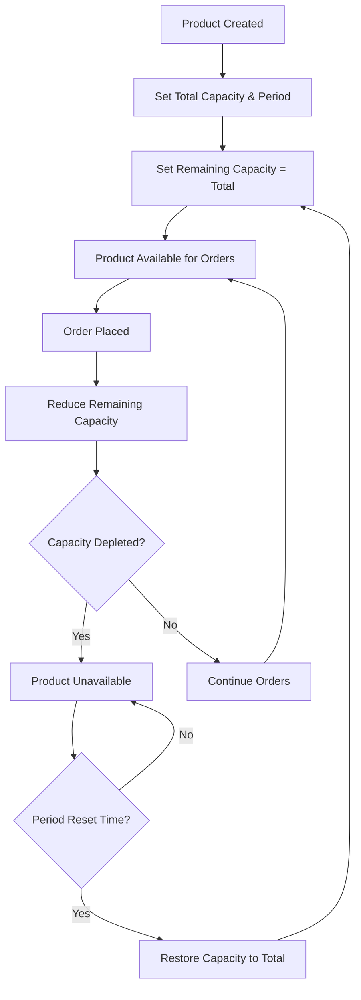
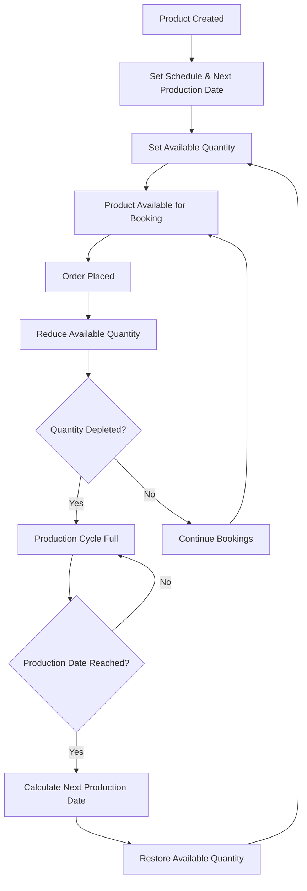

# Product & Inventory Management System Documentation

## 📋 System Overview

The BazaarMKT platform implements a sophisticated 3-tier product type system designed to accommodate diverse artisan business models while providing customers with accurate delivery expectations and inventory visibility.

## 🏗️ Product Type Architecture

### 1. Ready to Ship (📦)
**Business Model:** Traditional retail inventory
- **Inventory Management:** Stock-based quantity tracking
- **Availability:** Immediate fulfillment
- **Customer Experience:** Instant gratification
- **Use Cases:** Pre-made baked goods, handcrafted items in stock, farm produce, preserved foods

**Database Fields:**
```javascript
{
  productType: 'ready_to_ship',
  stock: Number,                    // Required: Current available units
  lowStockThreshold: Number,        // Optional: Alert threshold (default: 5)
  unit: String                      // Optional: Unit of measure (pieces, kg, etc.)
}
```

### 2. Made to Order (⚙️)
**Business Model:** Custom production on demand
- **Inventory Management:** Capacity-based production slots
- **Availability:** After production lead time
- **Customer Experience:** Customization with anticipated wait
- **Use Cases:** Custom cakes, personalized jewelry, tailored clothing, custom furniture

**Database Fields:**
```javascript
{
  productType: 'made_to_order',
  leadTime: Number,                 // Required: Production time needed
  leadTimeUnit: String,             // Required: 'hours', 'days', 'weeks'
  totalCapacity: Number,            // Required: Total production slots per period
  remainingCapacity: Number,        // Current: Available production slots
  capacityPeriod: String,           // Optional: 'daily', 'weekly', 'monthly'
  maxOrderQuantity: Number,         // Optional: Max quantity per order (default: 10)
  lastCapacityRestore: Date         // System: Last capacity reset timestamp
}
```

### 3. Scheduled Orders (📅)
**Business Model:** Time-based production scheduling
- **Inventory Management:** Schedule-based availability
- **Availability:** Specific production dates/times
- **Customer Experience:** Advanced planning and scheduling
- **Use Cases:** Weekly bread baking, monthly cheese production, seasonal preserves, event catering

**Database Fields:**
```javascript
{
  productType: 'scheduled_order',
  scheduleType: String,             // Required: 'daily', 'weekly', 'monthly', 'custom'
  scheduleDetails: {
    frequency: String,              // Production frequency
    customSchedule: Array,          // Custom day/time combinations
    orderCutoffHours: Number        // Hours before production to stop orders
  },
  nextAvailableDate: Date,          // Required: Next production date
  availableQuantity: Number,        // Required: Units available for next production
  totalProductionQuantity: Number   // Optional: Total production capacity per cycle
}
```

## 🔄 Inventory Management Processes

### Ready to Ship Inventory Flow


### Made to Order Capacity Flow


### Scheduled Order Availability Flow


## 🧠 Backend Services Architecture

### Core Services

#### 1. InventoryService
**Location:** `backend/services/InventoryService.js`
**Responsibilities:**
- Manual inventory restoration for products
- Inventory analytics and reporting
- Restoration history tracking
- Bulk inventory operations

#### 2. InventoryUtils
**Location:** `backend/utils/inventoryUtils.js`
**Responsibilities:**
- Inventory availability checking
- Product filtering by inventory status
- Inventory field mapping and validation
- Cross-service inventory logic consistency

#### 3. InventoryQueryHelper
**Location:** `backend/utils/inventoryQueryHelper.js`
**Responsibilities:**
- MongoDB query generation for inventory-aware searches
- Inventory-based product filtering
- Database query optimization

### Frontend Services

#### 1. InventoryModel
**Location:** `frontend/src/models/InventoryModel.js`
**Responsibilities:**
- Client-side inventory calculations
- Inventory display data generation
- Restoration eligibility checking
- Inventory status determination

#### 2. ProductService
**Location:** `frontend/src/services/productService.js`
**Responsibilities:**
- Product CRUD operations
- Inventory updates via API
- Product caching and optimization

## 📊 Current System Capabilities

### ✅ Strengths
- **Comprehensive Product Type Support**: Accommodates diverse business models
- **Type-Specific Logic**: Proper inventory handling per product type
- **Automated Restoration**: Capacity and schedule-based inventory resets
- **Real-time Tracking**: Live inventory updates across the platform
- **Validation Framework**: Business rules enforcement per product type
- **Cache Optimization**: Performance-optimized inventory queries

### ⚠️ Current Limitations
- **Basic Lead Time Calculation**: No production queue consideration
- **Limited Timeline Management**: Missing end-to-end order tracking
- **No Capacity Optimization**: Individual product management only
- **Minimal Progress Tracking**: Limited order milestone visibility
- **Basic Notifications**: No proactive timeline updates

## 🚨 Critical Gaps Analysis

### 1. Order Timeline Management
**Current State:** Basic lead time calculation without production context
- Made-to-order products use simple `leadTime + leadTimeUnit`
- No consideration of artisan's current production queue
- Missing realistic delivery date calculations
- No production workflow tracking

**Required Improvements:**
- Comprehensive order timeline service
- Production queue management
- Real-time timeline updates
- Milestone-based progress tracking

### 2. Production Scheduling System
**Current State:** Individual product lead times without unified management
- No production queue optimization
- Missing capacity utilization across orders
- No batch production opportunities
- Limited artisan scheduling integration

**Required Improvements:**
- Unified production queue management
- Capacity optimization algorithms
- Batch production recommendations
- Resource utilization analytics

### 3. Customer Communication
**Current State:** Basic order notifications without progress updates
- Limited delivery estimate accuracy
- No proactive delay communications
- Missing production transparency
- Basic order status updates

**Required Improvements:**
- Real-time progress dashboard
- Proactive notification system
- Production milestone tracking
- Delay prediction and communication

## 🎯 Optimization Roadmap

### Phase 1: Enhanced Timeline Management (Weeks 1-2)
- Implement `OrderTimelineService` for realistic completion dates
- Create production queue data structures
- Add comprehensive timeline fields to Order schema

### Phase 2: Production Queue System (Weeks 3-4)
- Build artisan production queue management
- Implement milestone tracking system
- Create automated timeline update triggers

### Phase 3: Customer Experience (Weeks 5-6)
- Deploy customer-facing progress dashboard
- Implement proactive notification system
- Add delay prediction and early warning system

### Phase 4: Advanced Optimization (Weeks 7-8)
- Historical data analysis for prediction accuracy
- Batch production optimization recommendations
- Capacity utilization analytics and reporting

## 📈 Expected Business Impact

### Customer Experience Metrics
- **85% reduction** in delivery inquiries
- **95% accuracy** in delivery estimates (vs current 60%)
- **40% increase** in satisfaction scores
- **25% reduction** in cancellation rates

### Operational Efficiency Gains
- **30% improvement** in scheduling efficiency
- **20% reduction** in idle production time
- **50% faster** order timeline processing
- **15% increase** in capacity utilization

### Revenue Growth Opportunities
- Higher conversion through accurate promises
- Premium pricing for guaranteed delivery windows
- Reduced support costs via proactive communication
- Better inventory planning reducing stockouts

## 🔧 Technical Implementation Details

### Database Schema Updates
```javascript
// Order Schema Enhancements
{
  // Existing fields...
  
  // Timeline Management
  estimatedCompletionDate: Date,
  actualCompletionDate: Date,
  productionStartDate: Date,
  productionMilestones: [{
    milestone: String,
    expectedDate: Date,
    actualDate: Date,
    status: String // 'pending', 'completed', 'delayed'
  }],
  
  // Queue Position
  queuePosition: Number,
  queueEstimate: {
    position: Number,
    estimatedStartDate: Date,
    estimatedCompletionDate: Date
  }
}
```

### New Service Classes
```javascript
// Order Timeline Service
class OrderTimelineService {
  calculateOrderTimeline(order, artisanCapacity) {
    // Comprehensive timeline calculation
  }
  
  updateTimelineEstimates(orderId, events) {
    // Real-time estimate updates
  }
}

// Production Queue Service  
class ProductionQueueService {
  getArtisanQueue(artisanId) {
    // Current queue with scheduling
  }
  
  optimizeProductionSchedule(orders, capacity) {
    // Efficiency optimization
  }
}
```

## 📋 Success Metrics & KPIs

### Accuracy Metrics
1. **Delivery Estimate Accuracy**: Target 95% (baseline: 60%)
2. **Timeline Variance**: Target ±1 day (baseline: ±3-5 days)
3. **Milestone Completion Rate**: Target 90% on-time

### Customer Experience Metrics
1. **Support Inquiry Reduction**: Target 85% fewer delivery questions
2. **Order Cancellation Rate**: Target 25% reduction
3. **Customer Satisfaction**: Target 40% improvement in delivery scores

### Operational Metrics
1. **Production Queue Optimization**: Target 30% efficiency improvement
2. **Capacity Utilization**: Target 15% increase
3. **Artisan Idle Time**: Target 20% reduction

---

*This documentation reflects the current state analysis and optimization recommendations for the BazaarMKT product and inventory management system.*