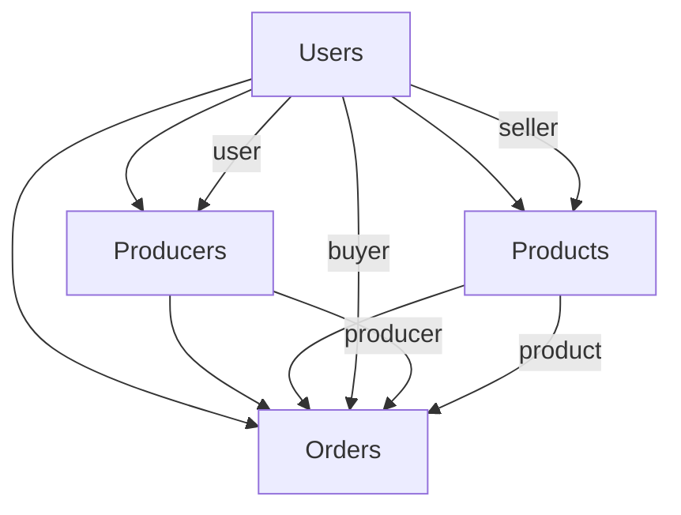

# 🗄️ Food Finder Application - Database Documentation

## 📋 Table of Contents
1. [Database Overview](#database-overview)
2. [Database Configuration](#database-configuration)
3. [Collections Structure](#collections-structure)
4. [Data Models](#data-models)
5. [Relationships](#relationships)
6. [File Storage](#file-storage)
7. [Indexes and Performance](#indexes-and-performance)
8. [Data Flow](#data-flow)
9. [Query Examples](#query-examples)
10. [Backup and Maintenance](#backup-and-maintenance)

---

## 🎯 Database Overview

### **Database Name**: `bazarmkt`
- **Type**: MongoDB (NoSQL Document Database)
- **Version**: MongoDB 6.0+
- **Connection String**: `mongodb://localhost:27017/bazarmkt`
- **Collections**: 4 main collections + file storage

### **Application Purpose**
A food marketplace platform connecting local producers (farmers, bakers, etc.) with consumers, enabling direct sales of fresh, local food products.

---

## ⚙️ Database Configuration

### **Connection Setup**
```javascript
// backend/server.js
mongoose.connect(process.env.MONGODB_URI || 'mongodb://localhost:27017/bazarmkt')
  .then(() => console.log('✅ MongoDB connected'))
  .catch(err => console.error('❌ MongoDB connection error:', err));
```

### **Environment Variables**
```env
MONGODB_URI=mongodb://localhost:27017/bazarmkt
```

---

## 📊 Collections Structure

### **Current Collections**
| Collection | Purpose | Document Count | Description |
|------------|---------|----------------|-------------|
| `users` | User accounts | 3 | All user accounts (buyers, producers, admins) |
| `products` | Product listings | 5 | Products available for sale |
| `producers` | Business profiles | 1 | Detailed producer business information |
| `orders` | Order transactions | 0 | Order history and transactions |

---

## 🏗️ Data Models

### **1. Users Collection (`users`)**

**Purpose**: Central user management for all account types

**Schema Structure**:
```javascript
{
  // Basic Information
  firstName: String (required),
  lastName: String (required),
  email: String (required, unique),
  password: String (required, bcrypt hashed),
  phone: String,
  
  // Address Information
  addresses: [{
    type: String (enum: ['home', 'work', 'other']),
    label: String,
    street: String,
    city: String,
    state: String,
    zipCode: String,
    country: String (default: 'Canada'),
    isDefault: Boolean (default: false)
  }],

  // Account Information
  role: String (enum: ['buyer', 'producer', 'admin', 'customer', 'food_maker']),
  profilePicture: String (URL or file path),
  
  // Notification Preferences
  notificationPreferences: {
    email: {
      marketing: Boolean,
      orderUpdates: Boolean,
      promotions: Boolean,
      security: Boolean
    },
    push: {
      orderUpdates: Boolean,
      promotions: Boolean,
      newProducers: Boolean,
      nearbyOffers: Boolean
    },
    sms: {
      orderUpdates: Boolean,
      promotions: Boolean
    }
  },

  // Payment Methods
  paymentMethods: [{
    type: String (enum: ['credit_card', 'debit_card', 'paypal']),
    last4: String,
    brand: String,
    expiryMonth: Number,
    expiryYear: Number,
    isDefault: Boolean,
    cardholderName: String,
    token: String
  }],

  // Account Settings
  accountSettings: {
    language: String (default: 'en'),
    currency: String (default: 'CAD'),
    timezone: String (default: 'America/Toronto'),
    twoFactorEnabled: Boolean (default: false)
  },

  // Timestamps
  createdAt: Date (default: Date.now),
  updatedAt: Date (default: Date.now)
}
```

**Sample Document**:
```json
{
  "_id": ObjectId("68a733164b78eb31b9af9ef3"),
  "firstName": "Ramzan",
  "lastName": "Ali",
  "email": "ramz@hotmail.com",
  "password": "$2b$10$BcfyLplKU/xfngCtwDUWlOQzG3...",
  "phone": "5148296989",
  "role": "producer",
  "profilePicture": null,
  "notificationPreferences": {
    "email": {
      "marketing": true,
      "orderUpdates": true,
      "promotions": true,
      "security": true
    },
    "push": {
      "orderUpdates": true,
      "promotions": true,
      "newProducers": true,
      "nearbyOffers": true
    },
    "sms": {
      "orderUpdates": false,
      "promotions": false
    }
  },
  "accountSettings": {
    "language": "en",
    "currency": "CAD",
    "timezone": "America/Toronto",
    "twoFactorEnabled": false
  },
  "addresses": [],
  "paymentMethods": [],
  "createdAt": ISODate("2025-08-21T14:54:14.519Z"),
  "updatedAt": ISODate("2025-08-21T14:54:14.601Z")
}
```

### **2. Products Collection (`products`)**

**Purpose**: Product catalog with inventory management

**Schema Structure**:
```javascript
{
  // Basic Information
  name: String (required),
  description: String (required),
  price: Number (required, min: 0),
  category: String (required),
  subcategory: String,
  
  // Inventory
  stock: Number (required, min: 0),
  unit: String (enum: ['piece', 'kg', 'lb', 'g', 'oz', 'dozen', 'bunch', 'pack', 'bottle', 'jar']),
  soldCount: Number (default: 0),
  
  // Product Details
  weight: Number (min: 0),
  expiryDate: Date,
  image: String (URL or file path),
  tags: [String],
  
  // Dietary Preferences
  isOrganic: Boolean (default: false),
  isGlutenFree: Boolean (default: false),
  isVegan: Boolean (default: false),
  isHalal: Boolean (default: false),
  
  // Status
  status: String (enum: ['active', 'inactive', 'out_of_stock']),
  
  // Seller Information
  seller: ObjectId (ref: 'User', required),
  
  // Timestamps
  createdAt: Date (default: Date.now),
  updatedAt: Date (default: Date.now)
}
```

**Sample Document**:
```json
{
  "_id": ObjectId("68a927c7e869425702d2cec0"),
  "name": "Bread",
  "description": "bread",
  "price": 10,
  "category": "Bakery",
  "subcategory": "Bread",
  "stock": 100,
  "unit": "piece",
  "soldCount": 0,
  "weight": null,
  "expiryDate": null,
  "image": "/uploads/products/image-1755916231829-653071106.jpg",
  "tags": [],
  "isOrganic": true,
  "isGlutenFree": true,
  "isVegan": false,
  "isHalal": false,
  "status": "active",
  "seller": ObjectId("68a733164b78eb31b9af9ef3"),
  "createdAt": ISODate("2025-08-23T02:30:31.839Z"),
  "updatedAt": ISODate("2025-08-23T02:30:31.842Z")
}
```

### **3. Producers Collection (`producers`)**

**Purpose**: Extended business information for producer accounts

**Schema Structure**:
```javascript
{
  // User Reference
  user: ObjectId (ref: 'User', required),
  
  // Basic Information
  type: String (enum: ['farm', 'bakery', 'individual']),
  name: String (required),
  description: String,
  category: String,
  specialties: [String],
  
  // Location
  address: {
    street: String,
    city: String,
    state: String,
    zipCode: String,
    lat: Number,
    lng: Number
  },
  
  // Contact
  phone: String,
  email: String,
  
  // Rating System
  rating: {
    average: Number (default: 0),
    count: Number (default: 0)
  },
  
  // Business Details
  operationDetails: {
    farmingMethods: String,
    sustainabilityPractices: String,
    certifications: [String],
    yearsInBusiness: Number,
    productionCapacity: String,
    qualityStandards: String
  },
  
  // Business Hours
  businessHours: {
    monday: { open: String, close: String, closed: Boolean },
    tuesday: { open: String, close: String, closed: Boolean },
    wednesday: { open: String, close: String, closed: Boolean },
    thursday: { open: String, close: String, closed: Boolean },
    friday: { open: String, close: String, closed: Boolean },
    saturday: { open: String, close: String, closed: Boolean },
    sunday: { open: String, close: String, closed: Boolean }
  },
  
  // Delivery Options
  deliveryOptions: {
    pickup: Boolean (default: true),
    delivery: Boolean (default: false),
    deliveryRadius: Number,
    deliveryFee: Number (default: 0)
  },
  
  // Media
  photos: [{
    url: String,
    caption: String,
    isPrimary: Boolean (default: false)
  }],
  
  // Status
  isActive: Boolean (default: true),
  createdAt: Date (default: Date.now)
}
```

**Sample Document**:
```json
{
  "_id": ObjectId("68a9303b405bcd47daf31e17"),
  "user": ObjectId("68a733164b78eb31b9af9ef3"),
  "type": "bakery",
  "name": "Ramzan's farm",
  "description": "Bread and pastries",
  "category": "bread",
  "specialties": ["Bread"],
  "address": {
    "street": "3440 rue alexandra",
    "city": "Saint-Hubert",
    "state": "Quebec",
    "zipCode": "J4T 3E9"
  },
  "rating": {
    "average": 0,
    "count": 0
  },
  "operationDetails": {
    "certifications": []
  },
  "businessHours": {
    "monday": {"closed": false},
    "tuesday": {"closed": false},
    "wednesday": {"closed": false},
    "thursday": {"closed": false},
    "friday": {"closed": false},
    "saturday": {"closed": false},
    "sunday": {"closed": false}
  },
  "deliveryOptions": {
    "pickup": true,
    "delivery": false,
    "deliveryFee": 0
  },
  "isActive": true,
  "photos": [],
  "createdAt": ISODate("2025-08-23T03:06:35.262Z")
}
```

### **4. Orders Collection (`orders`)**

**Purpose**: Order management and transaction history

**Schema Structure**:
```javascript
{
  // Participants
  buyer: ObjectId (ref: 'User', required),
  producer: ObjectId (ref: 'Producer', required),
  
  // Order Items
  items: [{
    product: ObjectId (ref: 'Product', required),
    quantity: Number (required, min: 1),
    unitPrice: Number (required),
    totalPrice: Number (required)
  }],
  
  // Financial
  totalAmount: Number (required),
  paymentStatus: String (enum: ['pending', 'paid', 'failed', 'refunded']),
  paymentMethod: String (enum: ['credit_card', 'debit_card', 'paypal', 'cash_on_delivery']),
  
  // Order Status
  status: String (enum: ['pending', 'confirmed', 'preparing', 'ready', 'delivering', 'delivered', 'cancelled']),
  preparationStage: String (enum: ['order_received', 'ingredients_gathered', 'production_started', 'quality_check', 'packaging', 'ready_for_delivery']),
  
  // Delivery Information
  deliveryAddress: {
    street: String,
    city: String,
    state: String,
    zipCode: String,
    country: String
  },
  deliveryInstructions: String,
  estimatedDeliveryTime: Date,
  actualDeliveryTime: Date,
  
  // Additional Information
  specialRequests: String,
  notes: {
    buyer: String,
    producer: String
  },
  
  // Timestamps
  createdAt: Date (default: Date.now),
  updatedAt: Date (default: Date.now)
}
```

---

## 🔗 Relationships

### **Entity Relationship Diagram**


### **Relationship Details**

#### **1. User → Products (One-to-Many)**
- **Relationship**: One user can sell many products
- **Field**: `products.seller` references `users._id`
- **Example**: User `68a733164b78eb31b9af9ef3` has 5 products

#### **2. User → Producer (One-to-One)**
- **Relationship**: One user can have one producer profile
- **Field**: `producers.user` references `users._id`
- **Example**: User `68a733164b78eb31b9af9ef3` has producer profile `68a9303b405bcd47daf31e17`

#### **3. User → Orders (One-to-Many)**
- **Relationship**: One user can place many orders (as buyer)
- **Field**: `orders.buyer` references `users._id`
- **Example**: Currently no orders in the system

#### **4. Producer → Orders (One-to-Many)**
- **Relationship**: One producer can receive many orders
- **Field**: `orders.producer` references `producers._id`
- **Example**: Currently no orders in the system

#### **5. Product → Orders (One-to-Many)**
- **Relationship**: One product can be in many orders
- **Field**: `orders.items.product` references `products._id`
- **Example**: Currently no orders in the system

---

## 📁 File Storage

### **Image Storage Structure**
```
backend/public/uploads/
└── products/
    ├── image-1755917733518-201106874.jpg (152KB)
    ├── image-1755917392008-239970162.jpg (152KB)
    ├── image-1755916438598-709436300.jpg (152KB)
    ├── image-1755916392970-90369616.jpg (152KB)
    ├── image-1755916231829-653071106.jpg (152KB)
    └── ... (more product images)
```

### **File Naming Convention**
- **Format**: `image-{timestamp}-{random}.{extension}`
- **Example**: `image-1755916231829-653071106.jpg`
- **Components**:
  - `image`: Fixed prefix
  - `1755916231829`: Unix timestamp
  - `653071106`: Random number for uniqueness
  - `.jpg`: File extension

### **File Storage Configuration**
```javascript
// backend/src/routes/products.js
const storage = multer.diskStorage({
  destination: (req, file, cb) => {
    cb(null, 'public/uploads/products');
  },
  filename: (req, file, cb) => {
    const uniqueSuffix = Date.now() + '-' + Math.round(Math.random() * 1E9);
    cb(null, 'image-' + uniqueSuffix + path.extname(file.originalname));
  }
});
```

### **Static File Serving**
```javascript
// backend/server.js
app.use('/uploads', express.static(path.join(__dirname, 'public/uploads')));
```

---

## 🚀 Indexes and Performance

### **Current Indexes**

#### **Products Collection**
```javascript
// Automatic indexes
productSchema.index({ seller: 1, status: 1 });
productSchema.index({ category: 1, subcategory: 1 });
productSchema.index({ tags: 1 });
```

#### **Users Collection**
```javascript
// Automatic indexes
userSchema.index({ email: 1 }); // Unique index
```

### **Recommended Additional Indexes**
```javascript
// For better search performance
db.products.createIndex({ "name": "text", "description": "text" });

// For location-based queries (future)
db.producers.createIndex({ "address.lat": 1, "address.lng": 1 });

// For order queries
db.orders.createIndex({ "buyer": 1, "createdAt": -1 });
db.orders.createIndex({ "producer": 1, "status": 1 });
```

---

## 🔄 Data Flow

### **User Registration Flow**
1. **Frontend**: User fills registration form
2. **Backend**: `POST /api/auth/register`
3. **Database**: Creates document in `users` collection
4. **Response**: Returns user data with JWT token

### **Product Creation Flow**
1. **Frontend**: Producer fills product form + uploads image
2. **Backend**: `POST /api/products` with `multer` middleware
3. **File System**: Image saved to `public/uploads/products/`
4. **Database**: Creates document in `products` collection
5. **Response**: Returns product data with image URL

### **Producer Profile Setup Flow**
1. **Frontend**: Producer fills business information
2. **Backend**: `POST /api/profile/producer`
3. **Database**: Creates document in `producers` collection
4. **Response**: Returns producer profile data

### **Order Creation Flow**
1. **Frontend**: Buyer selects products and places order
2. **Backend**: `POST /api/orders`
3. **Database**: Creates document in `orders` collection
4. **Inventory**: Updates product stock levels
5. **Response**: Returns order confirmation

---

## 🔍 Query Examples

### **Basic Queries**

#### **Find All Users**
```javascript
db.users.find().pretty()
```

#### **Find Products by Seller**
```javascript
db.products.find({seller: ObjectId("68a733164b78eb31b9af9ef3")}).pretty()
```

#### **Find Producer Profile**
```javascript
db.producers.find({user: ObjectId("68a733164b78eb31b9af9ef3")}).pretty()
```

### **Advanced Queries**

#### **Count Products by Category**
```javascript
db.products.aggregate([
  {$group: {_id: "$category", count: {$sum: 1}}}
])
```

#### **Find Active Products with Stock**
```javascript
db.products.find({
  status: "active",
  stock: {$gt: 0}
}).pretty()
```

#### **Find Products by Dietary Preferences**
```javascript
db.products.find({
  isOrganic: true,
  isGlutenFree: true
}).pretty()
```

#### **Search Products by Name**
```javascript
db.products.find({
  $text: {$search: "bread"}
}).pretty()
```

### **Aggregation Queries**

#### **Product Statistics**
```javascript
db.products.aggregate([
  {
    $group: {
      _id: null,
      totalProducts: {$sum: 1},
      averagePrice: {$avg: "$price"},
      totalStock: {$sum: "$stock"},
      categories: {$addToSet: "$category"}
    }
  }
])
```

#### **Seller Performance**
```javascript
db.products.aggregate([
  {
    $group: {
      _id: "$seller",
      productCount: {$sum: 1},
      totalStock: {$sum: "$stock"},
      averagePrice: {$avg: "$price"}
    }
  },
  {
    $lookup: {
      from: "users",
      localField: "_id",
      foreignField: "_id",
      as: "sellerInfo"
    }
  }
])
```

---

## 💾 Backup and Maintenance

### **Database Backup**
```bash
# Create backup
mongodump --db bazarmkt --out ./backups/$(date +%Y%m%d_%H%M%S)

# Restore backup
mongorestore --db bazarmkt ./backups/20250123_143022/bazarmkt/
```

### **File Storage Backup**
```bash
# Backup uploaded files
tar -czf ./backups/uploads_$(date +%Y%m%d_%H%M%S).tar.gz backend/public/uploads/
```

### **Database Maintenance**
```bash
# Check database size
db.stats()

# Check collection sizes
db.users.stats()
db.products.stats()
db.producers.stats()
db.orders.stats()

# Clean up orphaned files (manual process)
# Compare database image references with actual files
```

### **Performance Monitoring**
```javascript
// Check slow queries
db.getProfilingStatus()
db.setProfilingLevel(1, 100) // Log queries slower than 100ms

// Check index usage
db.products.getIndexes()
db.products.aggregate([{$indexStats: {}}])
```

---

## 🔧 Troubleshooting

### **Common Issues**

#### **1. Product Creation Fails**
- **Error**: `Product validation failed: seller: Path 'seller' is required`
- **Cause**: User ID not properly passed to product creation
- **Solution**: Ensure `req.user._id` is correctly set in authentication middleware

#### **2. Image Upload Fails**
- **Error**: `ENOENT: no such file or directory`
- **Cause**: Upload directory doesn't exist
- **Solution**: Create `backend/public/uploads/products/` directory

#### **3. Database Connection Issues**
- **Error**: `MongoNetworkError: connect ECONNREFUSED`
- **Cause**: MongoDB service not running
- **Solution**: Start MongoDB service: `brew services start mongodb-community`

### **Debugging Commands**
```bash
# Check MongoDB status
brew services list | grep mongodb

# Check database connection
mongosh bazarmkt --eval "db.runCommand('ping')"

# Check collection documents
mongosh bazarmkt --eval "db.users.countDocuments()"
mongosh bazarmkt --eval "db.products.countDocuments()"

# Check file permissions
ls -la backend/public/uploads/products/
```

---

## 📈 Future Enhancements

### **Planned Database Improvements**
1. **Geospatial Indexes**: For location-based product search
2. **Full-Text Search**: Enhanced product search capabilities
3. **Caching Layer**: Redis for frequently accessed data
4. **Data Archiving**: Move old orders to archive collection
5. **Analytics Collection**: Track user behavior and sales metrics

### **Scalability Considerations**
1. **Sharding**: Distribute data across multiple servers
2. **Read Replicas**: Separate read/write operations
3. **Connection Pooling**: Optimize database connections
4. **Data Compression**: Reduce storage requirements

---

## 📞 Support

For database-related issues or questions:
1. Check the troubleshooting section above
2. Review MongoDB logs: `/usr/local/var/log/mongodb/mongo.log`
3. Consult MongoDB documentation: https://docs.mongodb.com/
4. Contact the development team

---

*Last Updated: January 23, 2025*
*Version: 1.0*
