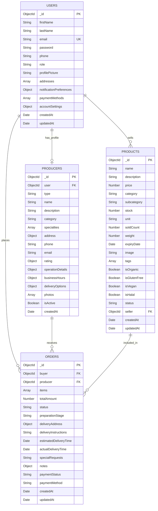
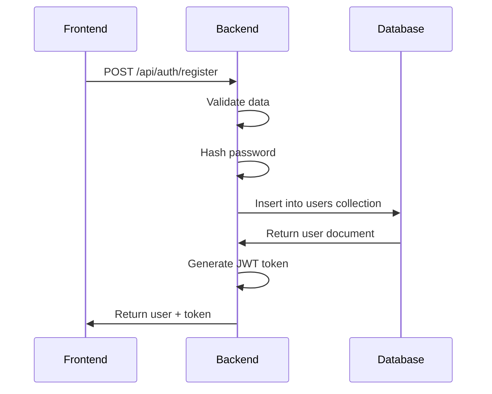
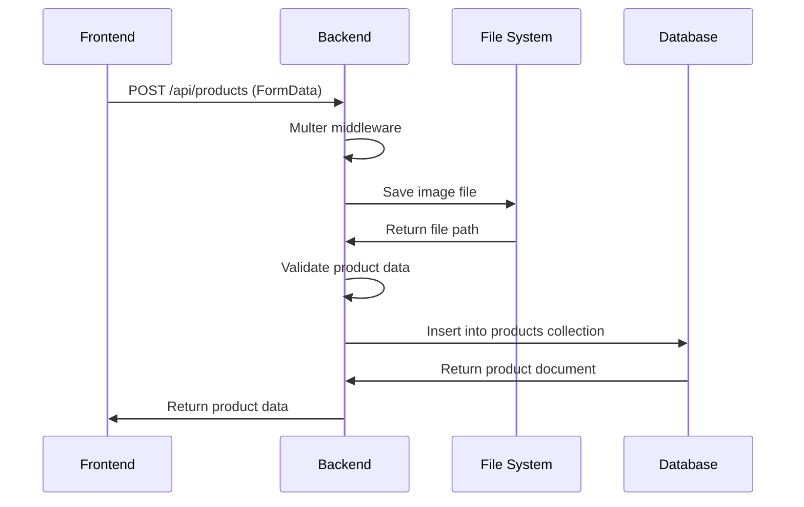
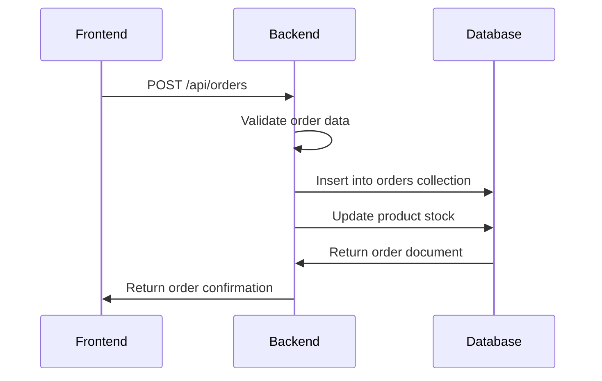

# 🗄️ Database Schema Documentation

## 📊 Entity Relationship Diagram



## 🏗️ Collection Schemas

### **Users Collection**

```mermaid
graph TD
    A[Users Collection] --> B[Basic Info]
    A --> C[Addresses]
    A --> D[Preferences]
    A --> E[Payment Methods]
    A --> F[Settings]
    A --> G[Timestamps]

    B --> B1[firstName: String]
    B --> B2[lastName: String]
    B --> B3[email: String]
    B --> B4[password: String]
    B --> B5[phone: String]
    B --> B6[role: String]
    B --> B7[profilePicture: String]

    C --> C1[type: String]
    C --> C2[label: String]
    C --> C3[street: String]
    C --> C4[city: String]
    C --> C5[state: String]
    C --> C6[zipCode: String]
    C --> C7[country: String]
    C --> C8[isDefault: Boolean]

    D --> D1[email: Object]
    D --> D2[push: Object]
    D --> D3[sms: Object]

    E --> E1[type: String]
    E --> E2[last4: String]
    E --> E3[brand: String]
    E --> E4[expiryMonth: Number]
    E --> E5[expiryYear: Number]
    E --> E6[isDefault: Boolean]
    E --> E7[cardholderName: String]
    E --> E8[token: String]

    F --> F1[language: String]
    F --> F2[currency: String]
    F --> F3[timezone: String]
    F --> F4[twoFactorEnabled: Boolean]

    G --> G1[createdAt: Date]
    G --> G2[updatedAt: Date]
```


### **Products Collection**

```mermaid
graph TD
    A[Products Collection] --> B[Basic Info]
    A --> C[Inventory]
    A --> D[Details]
    A --> E[Dietary]
    A --> F[Status]
    A --> G[Relationships]
    A --> H[Timestamps]

    B --> B1[name: String]
    B --> B2[description: String]
    B --> B3[price: Number]
    B --> B4[category: String]
    B --> B5[subcategory: String]

    C --> C1[stock: Number]
    C --> C2[unit: String]
    C --> C3[soldCount: Number]

    D --> D1[weight: Number]
    D --> D2[expiryDate: Date]
    D --> D3[image: String]
    D --> D4[tags: Array]

    E --> E1[isOrganic: Boolean]
    E --> E2[isGlutenFree: Boolean]
    E --> E3[isVegan: Boolean]
    E --> E4[isHalal: Boolean]

    F --> F1[status: String]

    G --> G1[seller: ObjectId]

    H --> H1[createdAt: Date]
    H --> H2[updatedAt: Date]
```


### **Producers Collection**

```mermaid
graph TD
    A[Producers Collection] --> B[Basic Info]
    A --> C[Location]
    A --> D[Business Details]
    A --> E[Operations]
    A --> F[Delivery]
    A --> G[Media]
    A --> H[Status]

    B --> B1[user: ObjectId]
    B --> B2[type: String]
    B --> B3[name: String]
    B --> B4[description: String]
    B --> B5[category: String]
    B --> B6[specialties: Array]

    C --> C1[street: String]
    C --> C2[city: String]
    C --> C3[state: String]
    C --> C4[zipCode: String]
    C --> C5[lat: Number]
    C --> C6[lng: Number]

    D --> D1[phone: String]
    D --> D2[email: String]
    D --> D3[rating: Object]

    E --> E1[farmingMethods: String]
    E --> E2[sustainabilityPractices: String]
    E --> E3[certifications: Array]
    E --> E4[yearsInBusiness: Number]
    E --> E5[productionCapacity: String]
    E --> E6[qualityStandards: String]

    F --> F1[pickup: Boolean]
    F --> F2[delivery: Boolean]
    F --> F3[deliveryRadius: Number]
    F --> F4[deliveryFee: Number]

    G --> G1[url: String]
    G --> G2[caption: String]
    G --> G3[isPrimary: Boolean]

    H --> H1[isActive: Boolean]
    H --> H2[createdAt: Date]
```


### **Orders Collection**

```mermaid
graph TD
    A[Orders Collection] --> B[Participants]
    A --> C[Items]
    A --> D[Financial]
    A --> E[Status]
    A --> F[Delivery]
    A --> G[Additional]
    A --> H[Timestamps]

    B --> B1[buyer: ObjectId]
    B --> B2[producer: ObjectId]

    C --> C1[product: ObjectId]
    C --> C2[quantity: Number]
    C --> C3[unitPrice: Number]
    C --> C4[totalPrice: Number]

    D --> D1[totalAmount: Number]
    D --> D2[paymentStatus: String]
    D --> D3[paymentMethod: String]

    E --> E1[status: String]
    E --> E2[preparationStage: String]

    F --> F1[street: String]
    F --> F2[city: String]
    F --> F3[state: String]
    F --> F4[zipCode: String]
    F --> F5[country: String]
    F --> F6[deliveryInstructions: String]
    F --> F7[estimatedDeliveryTime: Date]
    F --> F8[actualDeliveryTime: Date]

    G --> G1[specialRequests: String]
    G --> G2[buyer: String]
    G --> G3[producer: String]

    H --> H1[createdAt: Date]
    H --> H2[updatedAt: Date]
```


## 🔗 Relationship Details

### **One-to-Many Relationships**

#### **User → Products**
- **Cardinality**: 1:N
- **Foreign Key**: `products.seller` → `users._id`
- **Description**: One user can sell multiple products
- **Example**: User `68a733164b78eb31b9af9ef3` has 5 products

#### **User → Orders (as Buyer)**
- **Cardinality**: 1:N
- **Foreign Key**: `orders.buyer` → `users._id`
- **Description**: One user can place multiple orders
- **Example**: Currently no orders in system

#### **Producer → Orders**
- **Cardinality**: 1:N
- **Foreign Key**: `orders.producer` → `producers._id`
- **Description**: One producer can receive multiple orders
- **Example**: Currently no orders in system

#### **Product → Orders**
- **Cardinality**: 1:N
- **Foreign Key**: `orders.items.product` → `products._id`
- **Description**: One product can be in multiple orders
- **Example**: Currently no orders in system

### **One-to-One Relationships**

#### **User → Producer**
- **Cardinality**: 1:1
- **Foreign Key**: `producers.user` → `users._id`
- **Description**: One user can have one producer profile
- **Example**: User `68a733164b78eb31b9af9ef3` has producer profile `68a9303b405bcd47daf31e17`

## 📊 Data Types

### **Primitive Types**
- **String**: Text data (names, descriptions, emails)
- **Number**: Numeric data (prices, stock, ratings)
- **Boolean**: True/false values (flags, settings)
- **Date**: Timestamp data (creation, update times)
- **ObjectId**: MongoDB document identifiers

### **Complex Types**
- **Array**: Lists of values (tags, specialties, addresses)
- **Object**: Nested structures (addresses, preferences)
- **Enum**: Restricted string values (roles, statuses)

## 🔍 Indexes

### **Automatic Indexes**
```javascript
// Users Collection
{ "_id": 1 }                    // Primary key
{ "email": 1 }                  // Unique index

// Products Collection
{ "_id": 1 }                    // Primary key
{ "seller": 1, "status": 1 }    // Compound index
{ "category": 1, "subcategory": 1 } // Compound index
{ "tags": 1 }                   // Array index

// Producers Collection
{ "_id": 1 }                    // Primary key
{ "user": 1 }                   // Foreign key

// Orders Collection
{ "_id": 1 }                    // Primary key
```

### **Recommended Indexes**
```javascript
// Text search
db.products.createIndex({ "name": "text", "description": "text" });

// Geospatial (future)
db.producers.createIndex({ "address.lat": 1, "address.lng": 1 });

// Performance
db.orders.createIndex({ "buyer": 1, "createdAt": -1 });
db.orders.createIndex({ "producer": 1, "status": 1 });
db.products.createIndex({ "status": 1, "stock": 1 });
```

## 📈 Data Flow Diagrams

### **User Registration Flow**


### **Product Creation Flow**


### **Order Creation Flow**


## 🎯 Schema Validation

### **User Validation Rules**
```javascript
{
  firstName: { type: "string", required: true, minLength: 1 },
  lastName: { type: "string", required: true, minLength: 1 },
  email: { type: "string", required: true, format: "email", unique: true },
  password: { type: "string", required: true, minLength: 6 },
  role: { type: "string", enum: ["buyer", "producer", "admin"] }
}
```

### **Product Validation Rules**
```javascript
{
  name: { type: "string", required: true, minLength: 1 },
  description: { type: "string", required: true },
  price: { type: "number", required: true, minimum: 0 },
  stock: { type: "number", required: true, minimum: 0 },
  seller: { type: "objectId", required: true, ref: "User" }
}
```

---

*Schema Documentation - Version 1.0*
*Last Updated: January 23, 2025*
